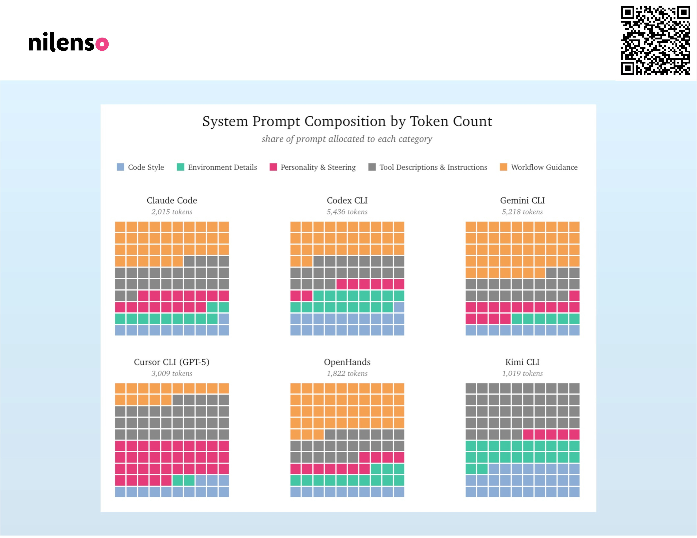
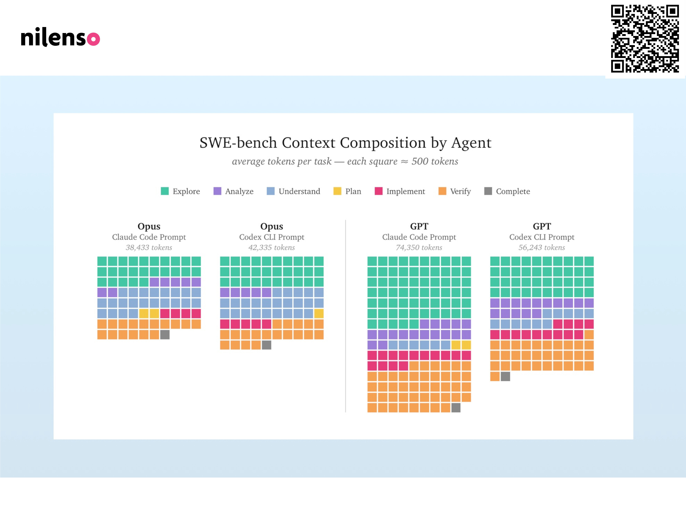
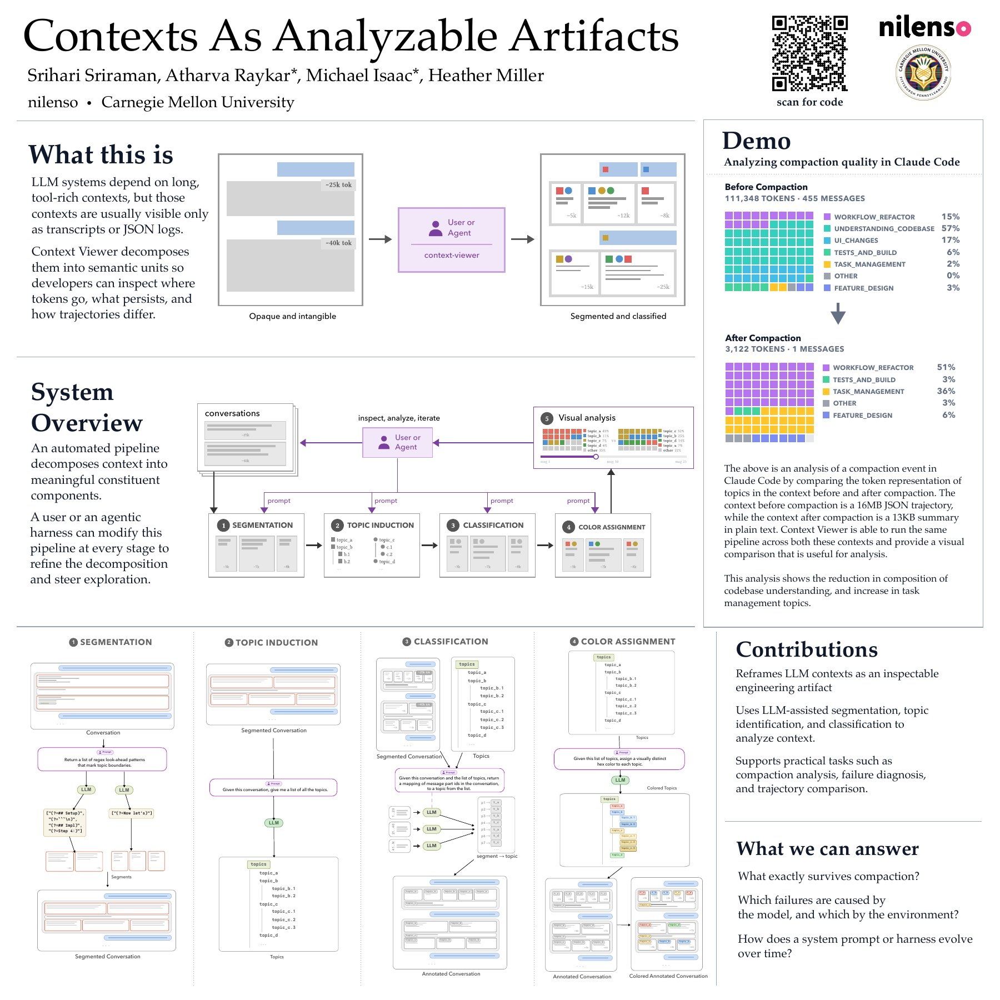

# Context Viewer

[](https://www.npmjs.com/package/@nilenso/context-lens)
[](https://www.npmjs.com/package/@nilenso/context-lens)
[](LICENSE)
[](https://nilenso.github.io/context-viewer/)

Observability for AI contexts. Context Viewer turns conversation logs, agent
transcripts, API traces, and long prompts into token-level, component-level
breakdowns: what is in the context window, how much space each part consumes,
and how those parts change across runs.

Try it in the hosted browser app at
[https://nilenso.github.io/context-viewer/](https://nilenso.github.io/context-viewer/),
or use the analyzer pipeline in your own tooling.

## Install the agent CLI

The agent-facing CLI is published as
[`@nilenso/context-lens`](https://www.npmjs.com/package/@nilenso/context-lens):

```bash
npm install -g @nilenso/context-lens
```

It is meant to be driven by an AI coding agent, not hand-operated. Once it is
installed, ask your agent to analyze a transcript with a prompt like:

```text
Use `context-lens` cli and analyze the sessions in agent-session.jsonl.
```

The agent should choose the analysis dimensions and components based on the
question, run `context-lens`, and return a concise interpretation plus a Context
Viewer link when sharing is useful.

## Research and recognition

- Paper/technical report: [Context Viewer on alphaXiv](https://www.alphaxiv.org/abs/context-viewer)
- Received an [Industry Spotlight Award at ACM CAIS 2026](https://www.caisconf.org/program/2026/demos/context-viewer/)
- Featured at [AI Engineer World's Fair (AIE WF) 2026](https://www.ai.engineer/worldsfair/2026)

## Screenshots

| Component waffle comparison | Prompt swapping on SWE-bench |
| --- | --- |
|  |  |

[](docs/screenshots/context-viewer-poster.pdf)

[Open the poster PDF](docs/screenshots/context-viewer-poster.pdf).

## Project architecture

Both the browser viewer and the CLI are built on top of the same analyzer
pipeline:

```text
        +--------------------+        +--------------------+
        |   Context Viewer   |        |  context-lens CLI  |
        |   browser UI       |        |  agent / terminal  |
        +----------+---------+        +----------+---------+
                   |                             |
                   +-------------+---------------+
                                 |
                                 v
                    +------------+-------------+
                    |        analyzer          |
                    | parse -> tokenise ->     |
                    | segment -> classify ->   |
                    | analytics + exports      |
                    +--------------------------+
```

Given a conversation transcript, the analyzer pipeline:

1. **Parses** the input and normalizes it to a standard message schema
2. **Counts tokens** using tiktoken with GPT-4o encoding
3. **Segments** large text parts into semantic chunks with AI
4. **Identifies components** or applies the dimensions/components you provide
5. **Classifies** every message part into components, batched and in parallel
6. **Colors** components and returns waffle-chart-ready analytics plus the full annotated conversation

### Supported input formats

| Format | File types |
| --- | --- |
| Claude Code transcripts | `.jsonl` |
| Codex CLI transcripts | `.jsonl` |
| OpenCode transcripts | `.json` |
| OpenAI Responses API | `.json` |
| OpenAI Completions API | `.json` |
| OpenAI Conversations API | `.json` |
| SWE-bench trajectories | `.json`, `.traj` |
| SWE-agent trajectories | `.json` |
| Context Viewer exports | `.json` |
| Plain text / markdown | `.txt`, `.md` |

## Sample analyses

Explore these pre-loaded comparisons to see what Context Viewer can do:

- [Coding agent system prompts compared](https://nilenso.github.io/context-viewer/g/960d42ad-314c-44cf-8594-4b009ef528a1/comparison?sidebar=0&panel=0&sortBy=category&sortDir=asc&import=https://raw.githubusercontent.com/nilenso/long-prompts-analysis/refs/heads/main/context-viewer-exports/system-prompts-simpler.json) — Claude Code, Cursor, Gemini CLI, Codex CLI, OpenHands, and Kimi CLI side by side
- [Claude Code prompt evolution](https://nilenso.github.io/context-viewer/g/b179a05f-2bd4-4012-83ab-42a0cb1e79fd/comparison?sidebar=0&panel=0&legend=compact&sortBy=category&sortDir=asc&cols=5&import=https://raw.githubusercontent.com/nilenso/long-prompts-analysis/refs/heads/main/context-viewer-exports/claude-prompt-evolution-export-simpler.json) — how Claude's system prompt has changed across model versions
- [Codex CLI prompt evolution](https://nilenso.github.io/context-viewer/g/56b68fb5-7221-4c04-807e-b590f138c1fe/comparison?sidebar=0&panel=0&view=tokens-absolute&legend=compact&sortBy=category&sortDir=asc&cols=10&spr=4&import=https://raw.githubusercontent.com/nilenso/long-prompts-analysis/refs/heads/main/context-viewer-exports/codex-prompt-evolution-export-only-codex.json) — Codex's system prompt changes over time
- [Swapping prompts on SWE-bench](https://nilenso.github.io/context-viewer/g/67175678-6244-45bc-b022-238b72f8e646/comparison?sidebar=0&panel=0&legend=compact&sortBy=category&sortDir=asc&cols=5&import=https://raw.githubusercontent.com/nilenso/long-prompts-analysis/refs/heads/main/context-viewer-exports/swapping-prompts-swe-tasks.json) — how different system prompts affect agent behavior on identical tasks
- [Claude Code compaction analysis](https://nilenso.github.io/context-viewer/g/9a548109-f714-4e4a-a590-cba88af2193f/comparison?sortBy=name&cols=2&import=https://gist.githubusercontent.com/ssrihari/c2d86626e43bd51935ffd0034a20a083/raw/e98ce0e82f7cd84e0b6a3220a0a3da15b3a2aecc/pre-post-compaction-analysis.json) — pre vs post compaction breakdown of Claude Code sessions

The first four samples are from Drew Breunig's [System Prompts Define the Agent as Much as the Model](https://www.dbreunig.com/2026/02/10/system-prompts-define-the-agent-as-much-as-the-model.html).

## Run locally

```bash
# Install bun, if needed
curl -fsSL https://bun.sh/install | bash

# Install dependencies
bun install

# Copy .env.example to .env and add your API key
cp .env.example .env
# Edit .env and set VITE_AI_API_KEY=your-api-key-here

# Start the development server
bun run dev

# Run tests
bun run test
```

## Environment configuration

The application supports automatic semantic segmentation of large message parts
using AI. This feature is optional but recommended for better analysis of large
conversations.

Create a `.env` file based on `.env.example`:

```bash
# AI API Configuration for Semantic Segmentation
VITE_AI_API_KEY=your-openai-api-key
VITE_AI_MODEL=gpt-4o-mini  # Optional, defaults to gpt-4o-mini
```

## Documentation

- [System overview](docs/system-overview.md) — data model, processing pipeline, visualizations, and interactive workflow
- [Workflow](docs/WORKFLOW.md) — multi-stage pipeline from conversation log to visual insights
- [Capabilities](docs/CAPABILITIES.md) — what Context Viewer can do
- [Categorisation](docs/categorisation.md) — how conversation content is organized into semantic categories
- [Segmentation](docs/segmentation.md) — splitting message parts into self-contained semantic units
- [Tech stack](docs/tech-stack.md) — TypeScript/React stack, build tools, and libraries
- [Long prompts analysis](docs/long-prompts.md) — patterns and evolution of system prompts across CLI tools

## Privacy and design

Conversation data is private. Your data should stay with you. Context Viewer
has no backend component: the browser app processes files locally, and the CLI
writes local exports. AI-based segmentation and classification are sent only to
the model provider you configure.

Input conversations should support many formats because this space is still
evolving. Parsers are implemented behind a shared interface so it is easy to add
another agent or API format.

## License

This project is licensed under the MIT License - see the [LICENSE](LICENSE) file for details.
