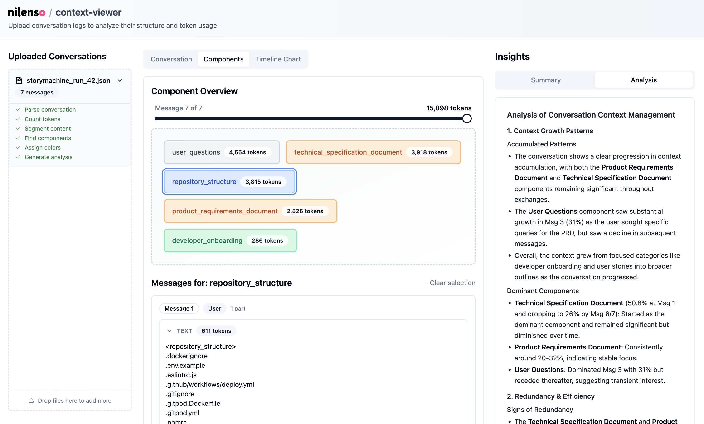

# Context Viewer

[](https://opensource.org/licenses/MIT)

Observability for contexts. Given a coversation log (messages), this
tool will provide a breakdown of its components and their sizes. It
also classifies messages into various categories so we can observe the
context in ways that matter to the business.

This tool itself is very simple, and the data mostly comes from a
single prompt that you can use yourself. The visualisations are useful
though.



### Quick Start

```bash
# Install bun (if not already installed)
curl -fsSL https://bun.sh/install | bash

# Install dependencies
bun install

# Copy .env.example to .env and add your API key
cp .env.example .env
# Edit .env and set VITE_AI_API_KEY=your-api-key-here

# Start the development server
bun run dev
```

### Environment Configuration

The application supports automatic semantic segmentation of large message parts using AI. This feature is optional but recommended for better analysis of large conversations.

Create a `.env` file based on `.env.example`:

```bash
# AI API Configuration for Semantic Segmentation
VITE_AI_API_KEY=your-openai-api-key
VITE_AI_MODEL=gpt-4o-mini  # Optional, defaults to gpt-4o-mini
```

## Design

Conversation data is private. Your data should stay with you. So this
implementation doesn't have a backend component. However, the
breakdown and classification is done by an LLM, so you'll need to
provide an API key. It could be an API key to the same provider as the
conversation, so the data stays in one place. This tool doesn't have a
server component which would require sending conversations to another
host apart from your model.

Input conversations should support a few formats, since this space is
evolving, still. To begin with, it will support the completions and
responses API formats. They're implemented behind an interface so it's
easy to add another format's parser.

Currently this tool only supports open-ai as the LLM provider, but the
idea is to be fully model and format agnostic. It uses vercel's AI
SDK, so it should be easy enough to add support for other providers.

## License

This project is licensed under the MIT License - see the [LICENSE](LICENSE) file for details.
